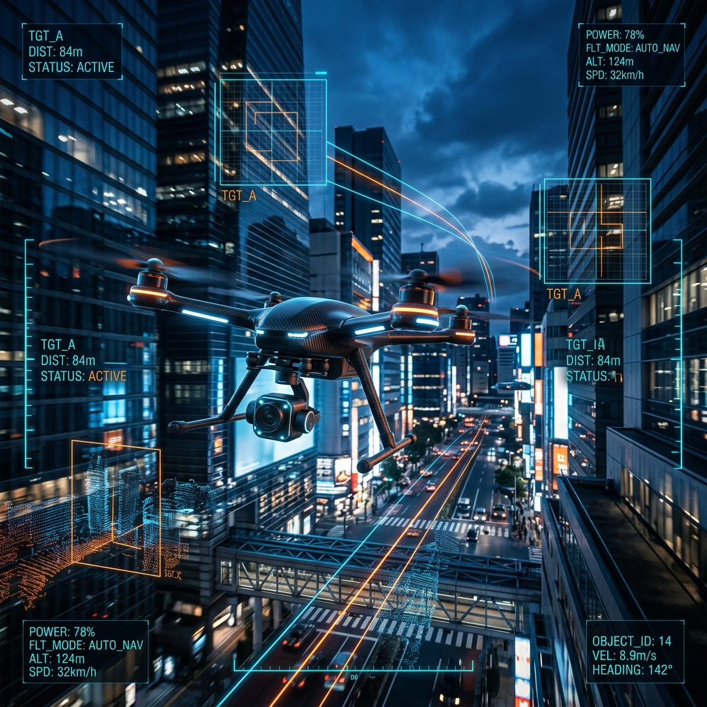
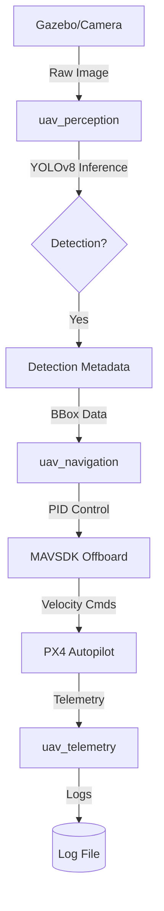

# 🚀 UAV Autonomy Framework

**A production-grade ROS2-based autonomous navigation and vision tracking system for Unmanned Aerial Vehicles.**



## 🌟 Overview

The **UAV Autonomy Framework** provides a robust, modular architecture for autonomous UAV operations. This project bridges high-level AI perception with low-level flight control by integrating **YOLOv8** object detection with a **MAVSDK-based PID controller**.

It is specifically designed for **ROS 2 Humble** and **Gazebo Harmonic**, offering a seamless Simulation-to-Hardware pipeline.

---

## ✨ Key Features

- 🎯 **AI Target Tracking**: Real-time object detection using YOLOv8 (Nano) with optimized inference.
- 🕹️ **PID Control Loop**: Dynamic following algorithm that adjusts Forward Velocity and Yaw Rate based on target position.
- 🔗 **MAVSDK/PX4 Integration**: Direct offboard control via MAVSDK for reliable flight maneuvers.
- 🌐 **Gazebo Harmonic Support**: Pre-configured `ros_gz_bridge` for synchronized sensor data and telemetry.
- 🐳 **Dockerized Environment**: One-command deployment including GUI support for RViZ and Gazebo.

---

## 🏗️ Architecture



---

## 🛠 Tech Stack

- **Robotics**: ROS 2 Humble, MAVSDK, MAVROS
- **Vision**: YOLOv8, OpenCV, CvBridge
- **Simulation**: Gazebo Harmonic, PX4 SITL
- **DevOps**: Docker Compose, NVIDIA Container Toolkit
- **Languages**: Python 3.10+, C++

---

## 🚀 Getting Started

### Prerequisites

- Docker & Docker Compose
- NVIDIA GPU Drivers (Required for YOLO/GZ acceleration)

### Quick Start (Docker)

The easiest way to run the framework is via Docker Compose:

1. **Clone and Enter**:
   ```bash
   git clone https://github.com/ashagire550/uav-autonomy-framework.git
   cd uav-autonomy-framework
   ```

2. **Launch everything**:
   ```bash
   docker-compose up
   ```
   *This will build the ROS 2 workspace, start the Gazebo bridge, and launch the autonomy nodes.*

### Manual Installation (Local)

1. **Install Dependencies**:
   ```bash
   pip install -r requirements.txt
   ```

2. **Build Workspace**:
   ```bash
   colcon build --symlink-install
   source install/setup.bash
   ```

3. **Launch Simulation**:
   ```bash
   ros2 launch uav_navigation simulation_launch.py
   ```

---

## 🗺 Roadmap

- [x] **Phase 1**: YOLOv8 Real-time perception logic.
- [x] **Phase 2**: PID-based target following algorithm.
- [x] **Phase 3**: Gazebo Harmonic & ROS 2 Humble bridge integration.
- [ ] **Phase 4**: ESDF-based local path planning for obstacle avoidance.
- [ ] **Phase 5**: Multi-UAV swarm synchronization.

---

## 📜 License

This project is licensed under the MIT License - see the [LICENSE](LICENSE) file for details.

---

## 🤝 Contributing & Feedback

Contributions are welcome! Please check the **[Implementation Plan](./docs/implementation_plan.md)** for detailed technical notes.
